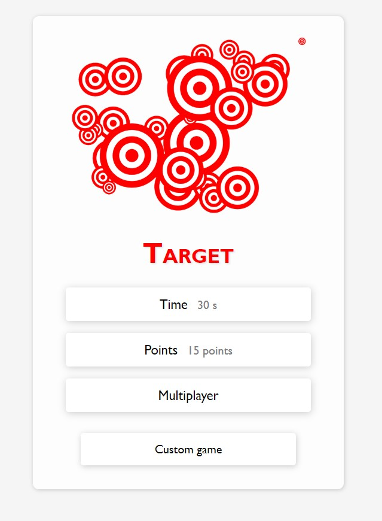
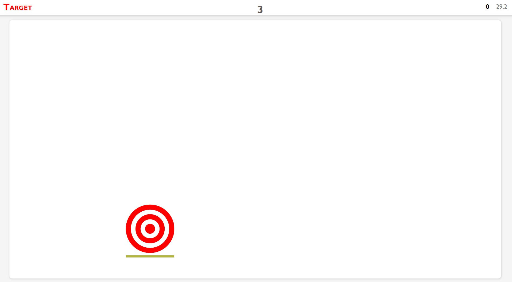

# Target Web Game

Welcome to the repository for "Target", an exciting web-based shooting game where precision leads to destruction!

## Overview

"Target" is a game that challenges players to shoot and destroy a target. The game mechanics are simple yet engaging - the more accurate your shot, the more damage you do. As you hone your skills, you can achieve higher levels of destruction and enjoy the satisfaction of perfect aim.

This game is built upon a simpler version developed by Tim Kmecl. We've expanded on the original concept to create an immersive and more challenging experience.

## Gameplay

- **Objective**: Destroy the target with precise shots.
- **Scoring**: Damage is calculated based on the accuracy of your shot. The closer you are to the center, the higher the damage.
- 

## How to Play

1. Start the game from the main menu.
2. Click or tap to aim and shoot at the target.
3. A health bar indicates the current health level of the target.
4. The game records your score based on the targets destroyed.

## Contributing

Contributions to "Target" are welcome! If you have ideas for new features, bug fixes, or improvements, please feel free to submit a pull request or open an issue.

## Credits

- Original Game Concept: Tim Kmecl
- Enhanced Development: Bernard Sovdat

We hope you enjoy playing "Target" as much as we enjoyed developing it!
